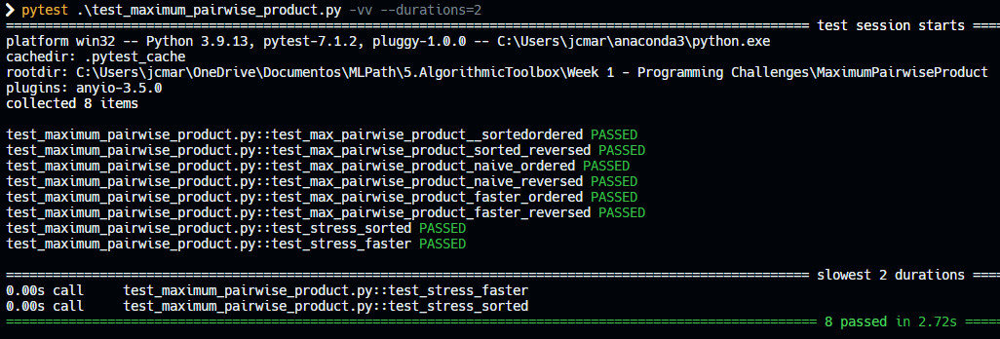

# Maximum Pairwise Product

## Problem Description

In this programming challenge, your goal is to implement a program that solves the maximum pairwise product in less than one second even on huge datasets.

## My solution

### maximum_pairwise_product.py

#### Using the built-in sorted() function

```python
def max_pairwise_product_sorted(lst):
    """Returns maximum pairwise product from lst"""
    lst = sorted(lst)
    return lst[-1] * lst[-2]
```

#### Naive implementation, iterating over the entire list n^2 times O(n^2)

```python
# O(n^2)
def max_pairwise_product_naive(lst):
    """Returns maximum pairwise product from lst"""
    l = len(lst)
    max_product = 0

    for i in range(l):
        for j in range(i + 1, l):
            curr_product = lst[i] * lst[j]
            if curr_product > max_product:
                max_product = curr_product

    return max_product
```

#### Faster implementation, iterating over the entire list twice O(2n)

```python
# O(n)
def max_pairwise_product_faster(lst):
    """Returns maximum pairwise product from lst"""
    tmp = [0, 0, 0, 0]
    for i, val in enumerate(lst):
        if val > tmp[0]:
            tmp[0] = val
            tmp[1] = i
    for i, val in enumerate(lst):
        if val > tmp[2] and i != tmp[1]:
            tmp[2] = val

    return tmp[0] * tmp[2]
```

## Tests



## Score


## Usage

1. Run 'python maximum_pairwise_product.py' on your command-line.
2. Input n.
3. Input n int numbers separated by whitespace.