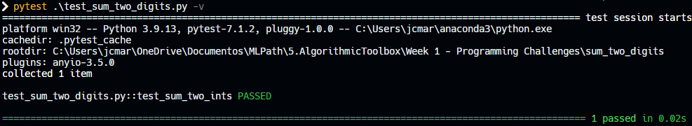

# Sum of two digits

## Problem Description

In this very first programming challenge, your goal is to implement a program that reads two digits from the standard input and prints their sum to the standard output.

## My solution

#### sum_two_digits.py

```python
def main():
    a, b = map(int, input().split())

    print(sum_two_ints(a, b))

def sum_two_ints(a, b):
    """Returns a + b"""
    return a + b


if __name__ == "__main__":
    main()

```

## Tests



## Score


## Usage

1. Run 'python sum_two_digits.py' on your command-line.
2. Input two digits separated by a space.